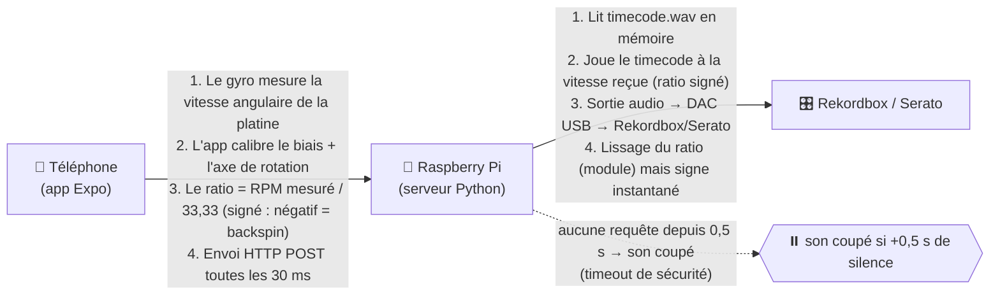

# 🚀 DVS DIY — PhaseApp


> **Un système DVS (Digital Vinyl System) 100% maison : ton téléphone posé sur la platine mesure la rotation avec son gyroscope, et un Raspberry Pi joue le timecode à la vitesse correspondante — le principe de Rekordbox/Serato, mais en DIY.**
> *Exemple : une platine vinyle contrôlée par ton téléphone + un Raspberry Pi, sans carte son dédiée.*

---

## 🧐 Aperçu

Le fonctionnement en un schéma :



- **Backspin & scratch fonctionnels** : le ratio est **signé** (négatif = lecture à reculons), détection quasi instantanée grâce au gyro à 100 Hz en mesure.
- **Calibration guidée** : biais → axe → mesure, avec recalage automatique continu du gain.
- **Réactif ET stable** : estimateur de phase (fenêtre glissante) qui annule le bruit du rocking, + motion snap qui colle la magnitude à la main pendant les scratchs (~50 ms).

## ✨ Fonctionnalités

- ✅ **Platine numérique DIY** : le téléphone devient la cellule DVS, le Pi le plateau.
- ✅ **Latence quasi nulle** : gyro 100 Hz, envoi HTTP 33 Hz, latence audio réduite (blocksize 512).
- ✅ **Sensible au pitch** : le recalage auto ne corrige que la dérive (±2 %), un pitch volontaire du DJ est respecté.
- ✅ **Anti-micro-geste** : à l'arrêt, un petit mouvement du poignet ne déclenche rien ; il faut un vrai geste soutenu.
- ✅ **Économie batterie** : en rotation = gyro 100 Hz + envoi 30 ms ; à l'arrêt = gyro 20 Hz + 1 envoi / 5 s.
- ✅ **Sélecteur 33/45/78** dans l'interface, indicateur de stabilité en direct.

## 🛠 Tech Stack

| Technologie | Usage |
| :--- | :--- |
|  | App mobile (Expo) : capteurs, UI, envoi HTTP |
|  | Build & dev client (Expo Go / dev build) |
|  | Serveur DVS sur Raspberry Pi (sounddevice) |
|  | Lecture du timecode → DAC USB → Rekordbox |

## 🚀 Installation & Lancement

1. **Cloner le projet**
   ```bash
   git clone https://github.com/BlackAngelTVdev/DVS-DIY.git
   cd DVS-DIY
   ```
2. **Installer les dépendances** (app)
   ```bash
   npm install
   ```
3. **Configurer l'IP du Raspberry Pi**
   Dans `tools/speedSender.js`, mets l'IP LAN de ton Pi :
   ```js
   export const SERVER_IP = '192.168.x.x'; // ← IP affichée au démarrage du serveur
   ```
4. **Lancer l'app**
   ```bash
   npm start          # démarre Metro sur le port 8082 (le 8081 est souvent pris)
   ```
   Scanne le QR code avec Expo Go ou un dev build.
5. **Côté Raspberry Pi** (dossier `~/phase`)
   ```bash
   python3 main.py    # ou l'alias : py main.py
   ```

## 📖 Utilisation

1. **« Calibrer biais »** — pose le téléphone **immobile** sur la platine (3 s).
2. **« Démarrer »** — lance la platine, attends ~1,5 s (détection de l'axe), tu es en **mesure** : le RPM s'affiche et le ratio part vers le Pi.
3. **« Arrêter »** — envoie `0` au serveur et coupe le flux.
4. Scratche, backspine, règle le pitch : le timecode suit ton plateau.

## 🤝 Contribution

1. Forkez le projet
2. Créez votre branche (`git checkout -b feature/AmazingFeature`)
3. Commitez (`git commit -m 'Add some AmazingFeature'`)
4. Poussez (`git push origin feature/AmazingFeature`)
5. Ouvrez une Pull Request

## 👤 Auteur

**BlackAngelTVdev**


---
## 📄 Licence

Ce projet est sous licence :


### 🧑‍💻 Contributors

Merci à toutes les personnes qui contribuent au projet.

[](https://github.com/BlackAngelTVdev/DVS-DIY/graphs/contributors)
