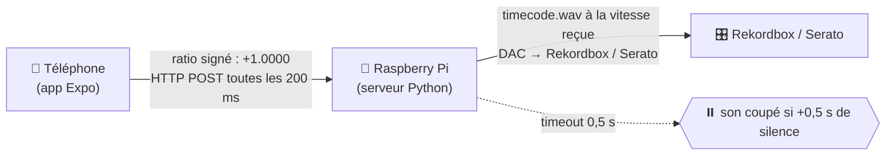

# 🎚️ DVS DIY — PhaseApp

Un système **DVS (Digital Vinyl System)** maison : ton téléphone posé sur la platine vinyle
mesure la vitesse de rotation avec son **gyroscope**, et un Raspberry Pi joue le **timecode
audio** à la vitesse correspondante — exactement le principe de Rekordbox/Serato, mais en DIY.



**Version texte** (terminaux) :

```
┌────────────────────┐    ratio signé (HTTP POST, 5 Hz)     ┌────────────────────┐
│     Téléphone      │  ─────────────────────────────────>  │    Raspberry Pi    │
│     (app Expo)     │        texte brut : "+1.0000"        │  (serveur Python)  │
│                    │                                      │                    │
│     gyro → RPM     │  <─────────────────────────────────  │    timecode.wav    │
│  → ratio / 33.33   │      pause si +0,5 s de silence      │  DAC → Rekordbox   │
└────────────────────┘                                      └────────────────────┘
```

- **Backspin & scratch fonctionnels** : le ratio est **signé** (négatif = lecture à reculons).
- **Calibration guidée** : biais → axe → mesure, avec recalage automatique continu.
- **Sans aucune librairie externe** côté UI (Animated natif de React Native).

---

## 🗂️ Structure du projet

```
.
├── App.js                     # Point d'entrée : connecte le hook au composant d'affichage
├── app.json                   # Config Expo (slug, package Android, EAS)
├── eas.json                   # Profils de build EAS (development / preview / production)
├── package.json               # Dépendances + scripts (start sur le port 8082)
│
├── tools/
│   ├── useRpmSensor.js        # Hook React : capteurs, calibration, calcul du RPM, envoi
│   ├── calibration.js         # Fonctions PURES : biais, axe, lissage, gain, relock… (testable)
│   ├── speedSender.js         # Envoi du ratio au Pi (HTTP POST, 5 Hz) — ⚠️ IP à configurer
│   ├── RpmDisplay.js          # Interface néon (compte-tours, stepper, état serveur)
│   └── test-calibration.mjs   # 48 tests unitaires de la logique de calibration
│
└── pi-server/
    ├── main.py                # Serveur DVS Python (à déployer sur le Pi)
    ├── dvs.service            # Service systemd (démarrage auto, optionnel)
    └── timecode.wav           # Ton fichier timecode (à copier sur le Pi)
```

---

## 📱 L'app (Expo)

### Prérequis

- Node.js + npm
- [Expo Go](https://expo.dev/go) ou un **dev build** (`expo-dev-client`) sur ton téléphone
- Le téléphone et le Pi **sur le même réseau Wi-Fi**

### Installation & lancement

```bash
npm install
npm start          # démarre le serveur Metro sur le port 8082
```

Puis scanne le QR code avec Expo Go / le dev build.

> ℹ️ Le port est **8082** (et non 8081) : le 8081 est souvent pris sur ce poste par le
> conteneur Docker **phpMyAdmin**. Si tu as besoin du 8081, libère-le avec `docker stop pma`.

### Utilisation

1. **« Calibrer biais »** — pose le téléphone **immobile** sur la platine (3 s).
2. **« Démarrer »** — lance la platine et laisse tourner **~1,5 s** (détection de l'axe),
   puis tu es en **mesure** : le RPM s'affiche et le ratio part vers le Pi.
3. **« Arrêter »** — envoie `0` au serveur et coupe le flux.

### ⚙️ Configuration

| Paramètre | Où | Valeur par défaut |
|---|---|---|
| **IP du Pi** | `tools/speedSender.js` → `SERVER_IP` | `192.168.1.140` |
| Port du Pi | `tools/speedSender.js` → `SERVER_PORT` | `5005` |
| RPM de référence | `tools/speedSender.js` → `REFERENCE_RPM` | `33.33` |
| Vitesses standard | `tools/calibration.js` → `STANDARD_SPEEDS` | `[33.33, 45, 78]` |

L'IP du Pi s'affiche au démarrage du serveur (`IP du serveur : 192.168.x.x`) — reporte-la dans
`speedSender.js` si elle change.

### 🔋 Optimisations batterie

- Gyro à **20 Hz** (50 ms), accéléromètre à **10 Hz** (ne sert qu'au rejet de choc)
- Envoi HTTP à **5 Hz** (200 ms) — 2,5× sous le timeout serveur de 0,5 s
- Re-rendus UI limités à ~12 fps (la valeur envoyée, elle, reste à jour à chaque échantillon)

---

## 🍓 Le serveur Pi

### Prérequis (sur le Raspberry Pi)

```bash
sudo apt install python3-pip portaudio19-dev
pip3 install numpy sounddevice soundfile zeroconf getkey
```

Puis copie dans `~/phase/` :
- `pi-server/main.py`
- ton fichier `timecode.wav` (celui qu'utilise déjà ta configuration DVS)

### Lancement

```bash
cd ~/phase
python3 main.py           # production (silencieux au démarrage)
python3 main.py --dev     # dev : contrôles clavier (▲ ▼ Espace = vitesse / pause)
python3 main.py --test    # auto-test : vérifie que le port 5005 répond, sans son
```

Le serveur :
- charge `timecode.wav` en mémoire et le joue via ton **DAC USB** (détecté automatiquement) ;
- écoute sur le **port 5005** (HTTP) et **coupe le son** si l'app n'envoie rien pendant **0,5 s** ;
- **lisse le ratio** (anti à-coucs) mais garde le **signe instantané** (backspin réactif) ;
- s'annonce en **mDNS** (`_dvs._udp.local.`) pour être trouvé sur le réseau.

### Démarrage automatique (watchdog, sans sudo)

Le serveur est protégé par un **watchdog cron** : toutes les minutes, si le port 5005 ne
répond pas, il relance le serveur. Il démarre donc **tout seul au boot** et survit aux crashs :

```bash
# ajouté sur le Pi via crontab -e
* * * * * (ss -ltn | grep -q :5005) || (cd ~/phase && setsid nohup python3 -u main.py >> dvs.log 2>&1 &)
```

Un service **systemd** (`dvs.service`) est fourni dans `pi-server/` pour les installations
sans conteneur : `sudo cp dvs.service /etc/systemd/system/ && sudo systemctl enable --now dvs`.

---

## 🧪 Tests

```bash
npm test
```

48 tests unitaires couvrant la logique de calibration pure (elle est isolée dans
`calibration.js` pour être testable en Node) :

- biais par médiane (robuste aux outliers), axe de rotation, lissage adaptatif au bruit
- **recalage automatique du gain** vers 33.3/45/78 (bande ±6 %, sans écraser un décalage voulu)
- **relâchement** de la platine → accrochage direct à la vitesse standard
- **ré-accrochage strict** : un petit geste (±17 RPM) ne déclenche rien, un vrai scratch oui
- arrêt brutal → remise à 0 immédiate, backspin → direction instantanée

---

## 🔍 Dépannage

| Problème | Cause / Solution |
|---|---|
| « Port 8081 is being used » au lancement d'Expo | Le conteneur Docker `pma` (phpMyAdmin) occupe 8081. `npm start` utilise déjà le port **8082**, ou libère-le : `docker stop pma` |
| L'app affiche `0.0` et rien ne bouge | Mauvaise IP du Pi dans `speedSender.js` ; vérifie le Wi-Fi (même réseau) ; `python3 main.py --test` sur le Pi pour vérifier le port 5005 |
| Le serveur coupe le son toutes les ~0,5 s | L'app n'envoie plus : vérifie le flux dans les logs du Pi (`FLUX ACTIF` / `AUCUNE DONNÉE`) |
| RPM affiché ~31-32 au lieu de 33.3 | Normal : le **recalage automatique du gain** corrige ça en ~15-20 s de rotation stable, puis le gain est mémorisé |
| À-coups dans le son | Le téléphone doit être **fermement fixé** sur la platine (velcro / Dual Lock). La mesure axiale + le lissage double (app + serveur) font le reste |
| Le backspin / scratch ne marche pas | Vérifie que l'axe a été calibré avec une rotation **avant** ; le ratio envoyé doit être négatif en backspin (logs `ratio reçu : -0.85`) |

---

## 🛠️ Build de production (EAS)

```bash
npx eas build --profile production --platform android
npx eas submit --platform android
```

Profils définis dans `eas.json` (`development` / `preview` / `production` avec auto-increment
de version). Le projet est lié au compte EAS `djdamss-team`.
